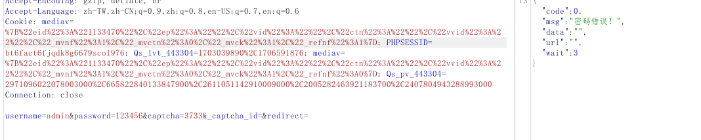

# 简介

使用python的selenium库对存在验证码的后台进行爆破

# 环境

```
python3
selenium 4
```
# 安装

1、安装chromedriver

```
https://googlechromelabs.github.io/chrome-for-testing/
```

下载完成后放到`config/chromedriver_win32`目录内

2、安装模块

```
pip3 install -r requirements.txt
```

3、下载chromedriver并移动到config\chromedriver_win32目录下

> ps: 默认已经设置好python的环境变量

4、设置xpath，`config\config.yaml`注释中已说明

5、运行

```
 python3 .\main.py -c .\config\config.yaml
```

# 配置说明

打开`config/config.yaml`文件,根据注释配置内容

## chromedriver 配置

不用多说，

```
CHROMEPATH: "C:\\Program Files\\Google\\Chrome\\Application\\chrome.exe"
DRIVERPATH: "config/chromedriver_win32/chromedriver.exe"
```

## 字典配置

```
username: "config/dic/debug_user.txt"
password: "config/dic/debug_pass.txt"
# username: "config/dic/debug_user.txt"
# password: "config/dic/password.txt"
```

在`config/dic/`内放置了5份字典

```
debug_user.txt	# admin
debug_pass.txt	# 123456
password.txt	# password top 1W
top7000.txt		# password top 7000
top500user.txt	# username top 500
```

其中`debug_user`和`debug_pass`是用来调试登录的，需要调试的有：

- 1、是否正常打开
- 2、验证码识别是否准确
- 3、能否正常完成登录操作
- 4、验证登录是否成功

## url 配置
```
url: "https://localhost/Admin/Login.aspx"
requests_url: "http://www.zzjzzlsb.cn/public/admin/public/dologin.html"
login_success: "welcome|登录成功"
login_failed: "登录失败|Login fail|用户名或密码错误|密码错误|登陆的帐号不存在|账号或密码错误|无效的用户信息"
captcha_error: "验证码不正确|验证码输入错误|请输入正确验证码|验证码错误"
```

需要说明的两个参数:

- `url`: 登录界面地址

- `requests_url`: 使用requests登录方式时的POST地址


登录成功只能当作参考，因为无法直接判断，但登录失败却可以直接判断出来，因此通过判断登陆失败，反推就是登录成功。

并且随着使用次数增多，不多添加`login_failed`和`captcha_error`的内容，逐步完善代码

具体判断代码在`modules/login_validate.py`内编写，传递给后面两种登录方法`modules/login_selenium.py`和`modules/login_request.py`


## 登录方法

```
login_config: "selenium"
```

有两种方法`selenium、 requests`可选，默认为`selenium`

这里说的仅仅是登录使用方法，验证码图片获取用的仍然是selenium

## selenium 配置

```
headless: True  # 无界模式
```

只有一个是否显示浏览器的选项，代码`modules/selenium_set.py`内已经内置自动使用忽略https证书

## xpath配置

```
username_data_xpath: "//*[@id=\"txtAdminName\"]"  # 用户名输入框XPath
password_data_xpath: "//*[@id=\"txtAdminPassWord\"]"  # 密码输入框XPath
captcha_data_xpath: "//*[@id=\"txtCode\"]"  # 验证码输入框XPath
captcha_update_xpath: "//*[@id=\"imgVerifyCode\"]"  # 验证码更新按钮XPath
button_xpath: "//*[@id=\"btnAdminLogin\"]"  # 登录按钮XPath
```

注释已经说明白了，其中如果有引号需要转义，如：`//*[@id="TxtAN"]`  转为 `//*[@id=\"TxtAN\"]`。

这里说下`验证码更新按钮`, 一般刷新验证码都是通过直接点击验证码图片实现的，这里也只能识别这类图片验证码,至于是base64还是其他的，没遇到过，所以还没调试

# 登录调试

前面提过登录调试，搭了个thinkcmf环境详细说一下

## 登录界面

首先完成config.yaml文件配置


如何获取xpath就不多说了，百度资料一堆

## 调试1：是否正常打开

为什么这么说，因为有些目标，虽然配置了完整路径，但通过selenium方式时会自动跳转到首页，举例

```
完整url为：http://localhost/public/admin/public/login.html

直接通过 browser.get(url) 打开时会自动跳转到https://localhost/index.html

这时候只需要修改url: http://localhost/admin/ 让浏览器自动跳转就行，代码中已经编写相应页面加载等待时间
```

直接运行代码通过观察浏览器情况即可，记得headless调整为`False`

靶机测试：设置admin后可以正常打开

## 调试2：验证码识别是否准确

这个也是直观判断，直接运行代码


可以看到chrome显示验证码错误，并且在终端也显示识别的验证码为65，很明显识别失败了，这怎么办呢。不要慌，多识别几遍就可以了


因此这里就需要代码进行处理了，这里也不完善，需要随经验继续改进，目前有几种解决方法，我使用的是第二种：

- 1、如果识别失败，则需要重新跑一遍
- 2、把失败的记录下来，后面再跑
- 3、想办法提高验证码清晰度，如利用验证码长宽可控漏洞

后续还是需要修改为第一种，比较自动

靶机测试：可以验证码识别，准确不不高

## 调试3：能否正常完成登录操作

一般不会出什么问题，但也存在特殊情况。

- 1、无法识别xpath。如使用vue框架的，识别出的源码只有一些调用js的html代码。因为当时那个目标不重要，所以就放弃了，代码上还没解决


目前已知的几种登录情况:

- 1、登录加密,可以找到加密函数，推荐使用requests，会快一些

- 2、登录加密,无法找到加密函数，只能使用selenium

- 3、登录不加密，推荐使用requests

靶机测试：可以完成正常登录

## 调试4：验证登录是否成功

验证是否登录成功是重头戏，在url 配置中的一句话`通过判断登陆失败，反推就是登录成功`就要用无数的代码去完成这个目标。

因为不仅是登录成功的状态无法准确判断，而且每一个目标所使用的提示方式也不同，目前已遇到的有三种：

- 1、登录后通过alert弹窗的方式提示账密错误，此时可以先判断是否存在弹窗，如果存在的话则按下键盘的Enter键。但弹窗也存在一些无法识别Enter的；
- 2、通过302跳转新页面提示账密错误；
- 3、直接在页面显示账密错误，这种情况可以判断返回包大小，也可以通过定位提示框内容来确定。

因此这个是每次都需要进行调试及编写相应识别代码的，代码文件在`modules/login_validate.py`内


靶机测试：现有代码无法验证登录是否成功，需要确认登录方法和登录验证代码



确认登录方法

- 通过抓包确认，登录发送的是明文，可以使用requests登录方法

确认登录验证代码

- 由于需要的`验证码识别结果`和`登录状态均`在返回的json数据内, 且没有合适的验证代码，需要再写一个

目前的代码流程为

- 1、通过selenium获取验证码
- 2、传参，将验证码和账密传入requests内进行提交。

这里有个bug尚未解决，如何确认此时提交的参数与验证码是对应的，所以在这种情况下我换用了[captcha-killer-modified](https://github.com/f0ng/captcha-killer-modified)， 灵活一些，学会变通，有空再研究为啥不行

# 更新历史

详情：`Update.md`

# 结语

以上就是本代码的基本使用教程，只支持单线程，也有很多bug，根据场景选择爆破方式，每次用的时候稍微改改就好。


# 参考

[selenium 弹出框的处理 switch_to.alert 三种类型](https://blog.csdn.net/chang995196962/article/details/89641100)

[Python之Selenium+Chromedriver爆破登录](https://www.yuque.com/corgi/yfbm4o/grormk)

[keybd_event模拟键盘输入](https://blog.csdn.net/qq_29360495/article/details/53006082)

[python+selenium+百度OCR 验证码识别登录](https://blog.csdn.net/weapon_host/article/details/104574073)